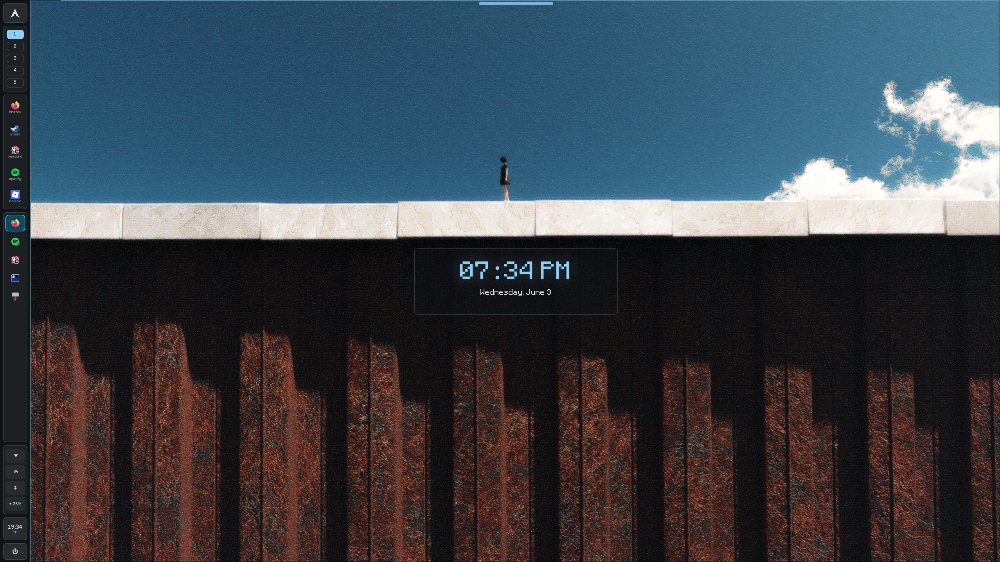

# SOLARIA ☀️



Personal Hyprland rice with a Quickshell side dock/status panel, Eww desktop clock and control hub, Matugen wallpaper colors, Rofi launchers, Mako notifications, Wlogout/NWG session tools, Ghostty, and bundled wallpapers.

Supported install targets:

- Arch Linux
- Debian
- Ubuntu
- Fedora
- NixOS

## Showcase

Video:

```text
https://www.youtube.com/watch?v=laLx_CHMZrc
```


## Included

- `dotfiles/.config/` includes Hyprland, Quickshell, Eww, Rofi, Mako, Wlogout, Ghostty, Fuzzel, Waybar, Matugen, GTK/Qt, Kvantum, Cava, Fastfetch, NWG, Cordial, Vencord/Vesktop theme files, and Spicetify files.
- `dotfiles/.local/bin/` includes the launcher, wallpaper, Matugen, dock reload, and theme helper scripts used by the rice.
- `dotfiles/.local/share/fonts/` includes the bundled Mojang/Mojangles-style fonts used by the clock and menus.
- `dotfiles/.local/bin/solaria-dots` includes the profile manager app for creating and switching dot profiles.
- `wallpapers/` includes the wallpaper set from `~/Pictures/WALLPAPERS`.
- `assets/screenshot.png` is the rice screenshot.

## Install

The installer backs up replaced configs into `~/.rice-backups/noah-hyprland-rice-*`, copies wallpapers without overwriting existing wallpaper files, and rewrites repo placeholders to your `$HOME`.

```bash
chmod +x install.sh
./install.sh
```

Package installation is distro-aware:

- Arch uses `pacman`, plus `yay` or `paru` for AUR packages.
- Debian and Ubuntu use `apt-get` for packages available in their repos.
- Fedora uses `dnf`.
- NixOS users should add `extras/nixos/configuration-example.nix` to their NixOS imports, rebuild, then run `./install.sh --no-packages`.

Useful options:

```bash
./install.sh --no-packages
./install.sh --packages --flatpaks -y
./install.sh --no-wallpapers
```

Detailed distro notes are in [docs/DISTROS.md](docs/DISTROS.md).

## Dot Profile Manager

The installer adds `SOLARIA Dot Manager`, a small app for creating new dot profiles and switching between them. It also seeds a built-in `solaria` profile so you can switch back to this rice later.

Open it from your app launcher, or run:

```bash
solaria-dots
```

Useful commands:

```bash
solaria-dots save my-rice
solaria-dots switch solaria
solaria-dots switch my-rice
solaria-dots open
```

Full docs are in [docs/DOT_MANAGER.md](docs/DOT_MANAGER.md).

After installing, log out and start Hyprland again, or run:

```bash
hyprctl reload
```

## Notes

- The Hyprland config uses `monitor = ,preferred,auto,1` so it can boot on other machines. My original monitor lines are left commented in `dotfiles/.config/hypr/hyprland.conf`.
- The current wallpaper is set to `wallpapers/122440215_p0.png`.
- `gpu-screen-recorder` replay buffer autostart is included as a commented optional line, not enabled by default.
- Optional dock apps include Firefox, Steam, Vesktop/Vencord, Spotify, and Sober/Roblox. Install the apps you actually want.
